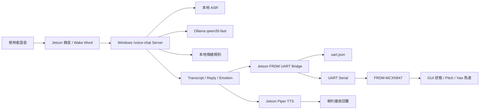

# MakeNTU 機器人互動系統架構說明書

日期：2026-05-06

## 1. 系統概述

本專案是一套結合語音互動、自然語言模型、本地文字轉語音、UART 通訊與 FRDM-MCXN947 控制板的桌面機器人互動系統。系統目標是讓使用者能透過語音與機器人互動，由 AI 產生自然回覆與情緒判斷，再由 Jetson 將狀態轉換為 FRDM 可執行的 UART 指令，控制機器人的畫面狀態與馬達動作。

目前專案中同時存在兩條架構路線：
user-P3fEfNxF6Vlx1cQwHAtJEUxu
1. 實際 demo 主線：`frdm_uart_context_sender` 整合語音聊天、FRDM UART 指令與 TTS 播放，使用 FRDM 既有 monitor command，例如 `Sleep`、`Normal`、`MotorPitch`、`MotorYaw`。
2. 完整情緒控制骨架：`emotion_robot_controller` 定義較完整的 `$PAYLOAD*checksum` UART 協定、情緒決策資料模型、motion profile 與 FRDM firmware parser，作為後續擴充成完整情緒機器人控制系統的基礎。

## 2. 系統整體架構

目前實際語音互動 demo 的主要資料流如下：



系統採分散式設計。Jetson 負責硬體周邊、錄音、UART 與 TTS；Windows 桌機負責較重的 ASR 與 Ollama 推論；FRDM-MCXN947 負責最終硬體控制。

## 3. 主要模組分工

### 3.1 Jetson 語音與 FRDM 橋接層

位置：`frdm_uart_context_sender/`

此模組是目前 demo 的主線整合層。它不直接修改原本的 `voice_stt_remote`、`emotion_robot_controller` 或 `jetson_piper_tts`，而是以橋接方式串起語音聊天、UART 指令與 TTS。

主要檔案：

| 檔案 | 功能 |
| --- | --- |
| `voice_chat_frdm_uart_bridge.py` | Enter 錄音版語音聊天 + FRDM UART + TTS 主程式 |
| `wake_voice_chat_frdm_bridge.py` | Wake word hands-free 版主程式 |
| `frdm_uart_context_sender.py` | 將目前 context / transcript / reply / emotion 轉換成 FRDM UART 指令 |
| `uart.json` | 每次互動後產生的 UART 決策紀錄 |

目前支援的 FRDM 指令如下：

```text
Sleep
Normal
ShowNum <number>
MotorPitch <angle>
MotorYaw <angle>
```

實際送到 FRDM 的 UART 文字範例：

```text
Sleep\r\n
Normal\r\n
MotorPitch 90\r\n
MotorYaw 90\r\n
```

這條路線的優點是能直接對接目前 FRDM firmware 既有的 `SMONITORCOMMAND` command table，適合快速 demo 與硬體測試。

### 3.2 Windows 語音聊天服務

位置：`emotion_robot_controller/voice_stt_remote/`

Windows 桌機負責執行語音辨識與大型語言模型推論。Jetson 端錄音後會將 WAV 音訊送到 Windows server，Windows server 再回傳文字轉錄、自然語言回覆、情緒判斷與 timing 資訊。

主要檔案：

| 檔案 | 功能 |
| --- | --- |
| `desktop_fast_chat_server.py` | Flask server，提供 `/voice-chat`、`/text-chat`、`/health` |
| `desk_voice_controller.py` | ASR 與 Ollama 共用工具 |
| `jetson_fast_voice_chat.py` | Jetson 端語音 client，供 bridge 匯入使用 |
| `windows_desktop_server_bundle/` | 給 Windows 桌機部署使用的 bundle |

Windows 端主要流程：

```text
收到 Jetson WAV 音訊
-> 本地 ASR 轉文字
-> Ollama qwen35-fast 產生自然回覆
-> 本地規則分析情緒
-> 回傳 JSON response
```

此架構不依賴 Gemini 或 OpenAI 雲端 API，語音聊天主線使用本地 Windows 桌機與 Ollama。

### 3.3 Jetson 本地 TTS

位置：`jetson_piper_tts/`

此模組提供 Jetson 本地離線中文 TTS 服務。它使用 Piper TTS 與中文 voice，將 Windows server 回傳的 `reply` 文字轉成語音並透過 ALSA / `aplay` 播放。

主要功能：

| 功能 | 說明 |
| --- | --- |
| FastAPI server | 提供 `/speak_async`、`/health` 等 API |
| Piper in-process engine | 常駐載入 PiperVoice / ONNX session，降低延遲 |
| 中文文字處理 | 支援繁簡轉換、標點切句與文字清理 |
| 播放佇列 | 支援非同步播放、插隊與 interrupt |
| Voice 選擇 | 支援 `zh_CN-chaowen-medium`、`zh_CN-huayan-medium`、`zh_CN-xiao_ya-medium` 等 |

在完整互動流程中，TTS 只負責播放 `reply`，不參與 FRDM 指令決策。

### 3.4 UART 診斷與硬體測試層

位置：`Uart/`

此資料夾主要用於 Jetson UART 腳位、權限與 TX/RX loopback 測試。它是最底層的硬體診斷工具，不負責 AI 或情緒邏輯。

主要檔案：

| 檔案 | 功能 |
| --- | --- |
| `uart_diagnostic.py` | 開啟指定 UART，寫入測試資料並檢查是否能讀回 |
| `uart_testloopback.py` | 偵測 UART、列出資訊、執行 loopback 測試或單向送資料 |

`uart_diagnostic.py` 的測試流程：

```text
檢查 pyserial
-> 開啟 /dev/ttyTHS1
-> 清除 input/output buffer
-> 寫入 LOOPBACK_TEST_123
-> 檢查 RX buffer
-> 比對接收資料是否與送出資料一致
```

此層可用來確認 Jetson UART 硬體與接線是否正常，再往上測試 FRDM command 或完整語音互動流程。

### 3.5 完整情緒控制骨架

位置：`emotion_robot_controller/`

此模組是較完整、工程化的情緒機器人控制架構。它定義了 AI 決策格式、情緒與 motion 對應表、checksum UART 協定、Python serial bridge，以及 FRDM firmware parser / motion controller。

PC / Jetson 端流程：

```text
文字輸入
-> AI backend 分析情緒
-> EmotionDecision 資料驗證
-> PacketBuilder 產生 $ACT,...*checksum
-> SerialBridge 送出 UART 封包
-> 等待 FRDM ACK / NACK / STATUS / PONG
```

FRDM 端流程：

```text
UART 收到一行封包
-> command_parser_parse()
-> 驗證 checksum 與欄位數
-> 檢查 motion_id / emotion / safety range
-> 回傳 ACK 或 NACK
-> 執行 face controller 與 motion controller
```

完整協定範例：

```text
$ACT,12,DIALOGUE,FACE_HAPPY,HAPPY_NOD_SWAY,0,-5,25,1200*CS
$EMO,13,happy*CS
$TEST,14,CENTER*CS
$PING,15*CS
```

此架構目前仍是整合骨架。FRDM firmware 的 `main.c` 中，實際 UART RX/TX、delay 與 PWM driver 仍需要依照 MCUXpresso SDK 與硬體腳位進行實作。

## 4. 資料格式與通訊協定

### 4.1 Demo 主線的簡單 UART 指令

目前實際使用的 FRDM monitor command 是純文字指令，每行以 CRLF 結尾：

```text
Command [argument]\r\n
```

範例：

```text
Sleep\r\n
Normal\r\n
ShowNum 7\r\n
MotorPitch 60\r\n
MotorYaw 120\r\n
```

Jetson bridge 會依據 transcript、reply、emotion、context 或手動指定 command，決定要送哪些指令。例如：

| 情境 | 可能輸出 |
| --- | --- |
| 使用者說想睡、很累 | `Sleep` |
| 一般對話或喚醒 | `Normal` |
| 文字包含往左看 | `MotorYaw 60` |
| 文字包含往右看 | `MotorYaw 120` |
| 文字包含抬頭 | `MotorPitch 60` |
| 文字包含低頭 | `MotorPitch 120` |

### 4.2 完整情緒控制協定

`emotion_robot_controller` 使用較完整的封包格式：

```text
$PAYLOAD*CS\n
```

其中：

| 欄位 | 說明 |
| --- | --- |
| `$` | 封包起始符 |
| `PAYLOAD` | 逗號分隔的命令與欄位 |
| `*` | checksum 分隔符 |
| `CS` | payload bytes XOR checksum |
| `\n` | 行結尾 |

支援命令包含：

| 命令 | 用途 |
| --- | --- |
| `ACT` | 執行情緒對應的臉部與 motion 動作 |
| `EMO` | 只送 emotion，由 FRDM 查表決定 motion |
| `TEST` | 執行測試 motion |
| `RESET` | 重置臉部與馬達中心 |
| `STATUS` | 查詢目前狀態 |
| `PING` | 檢查通訊是否正常 |

FRDM 回覆：

```text
$ACK,seq,OK*checksum
$NACK,seq,ERROR_CODE,ERROR_MESSAGE*checksum
$PONG,seq,OK*checksum
$STATUS,seq,OK,face=FACE_NEUTRAL,busy=0*checksum
```

## 5. 執行與部署關係

系統執行時可分為三台或三個角色：

| 角色 | 執行內容 | 主要責任 |
| --- | --- | --- |
| Jetson Orin Nano | `voice_chat_frdm_uart_bridge.py`、`jetson_piper_tts`、UART scripts | 錄音、橋接、TTS、UART |
| Windows 桌機 | `desktop_fast_chat_server.py`、Ollama、ASR model | ASR、LLM 回覆、情緒規則 |
| FRDM-MCXN947 | 既有 monitor command 或 emotion robot firmware | GUI 狀態、馬達控制、ACK/NACK |

典型啟動順序：

1. Windows 啟動 Ollama。
2. Windows 啟動 `desktop_fast_chat_server.py`。
3. Jetson 啟動 `jetson_piper_tts` server。
4. Jetson 確認 UART 裝置，例如 `/dev/ttyACM0` 或 `/dev/ttyTHS1`。
5. Jetson 執行 `voice_chat_frdm_uart_bridge.py` 或 `wake_voice_chat_frdm_bridge.py`。
6. 使用者開始語音互動。

## 6. 目前完成狀態

目前已完成：

| 項目 | 狀態 |
| --- | --- |
| Jetson UART loopback / 診斷工具 | 已完成 |
| Windows 本地語音聊天 server | 已完成 |
| Jetson 語音 client | 已完成 |
| Jetson Piper TTS server | 已完成 |
| 語音聊天到 FRDM UART bridge | 已完成 |
| 簡單 FRDM monitor command 轉換 | 已完成 |
| `uart.json` 輸出紀錄 | 已完成 |
| 完整 checksum UART protocol | Python 與 C 核心已建立 |
| FRDM motion profile / parser / safety framework | 已建立骨架 |

尚待整合：

| 項目 | 說明 |
| --- | --- |
| FRDM raw UART parser | `main.c` 的 UART read/write 仍需接 MCUXpresso SDK |
| FRDM PWM driver | 需依實際 pin mux 與 PWM peripheral 實作 |
| 兩顆伺服馬達獨立控制 | 需確認 `MotorPitch` 與 `MotorYaw` 是否已對應不同 PWM channel |
| 完整情緒協定上板 | 需將 `ERobot` 或 raw `$PAYLOAD*CS` parser 接進現有 firmware |
| 視覺模組整合 | `vision/` 目前是獨立測試腳本，尚未接入主互動流程 |

## 7. 視覺模組補充

位置：`vision/`

視覺模組目前是獨立測試用途，負責使用 camera 擷取最新畫面，再送到 Ollama vision 或 Gemini 進行圖片理解。它尚未接入主線語音互動與 FRDM 控制流程。

目前已有功能包含：

| 檔案 | 功能 |
| --- | --- |
| `latest_frame_camera.py` | 背景持續讀取最新 camera frame，降低拍照延遲 |
| `camera_object_comment.py` | 辨識使用者手上拿的物品並產生評論 |
| `camera_ollama_status.py` | 使用 Ollama vision 判斷畫面中人的表情或狀態 |
| `camera_gemini.py` | 使用 Gemini 分析相機照片 |

未來可將視覺分析結果加入 `context`，讓 bridge 同時根據語音、情緒與視覺狀態決定 FRDM 動作。

## 8. 系統特色

本專案的主要特色如下：

1. 分散式低延遲架構：Jetson 負責硬體 I/O，Windows 負責高負載模型推論。
2. 本地 AI 主線：目前語音聊天主線不依賴雲端 AI API。
3. 硬體漸進整合：先以簡單 FRDM monitor command 完成 demo，再逐步升級到完整 checksum protocol。
4. 可診斷性高：UART loopback、server health check、TTS health、`uart.json` 都能協助定位問題。
5. 可擴充性高：情緒 mapping、motion profile、face_id、vision context 與 TTS voice 都可逐步擴充。

## 9. 架構總結

目前系統最穩定的實作主線是：

```text
Jetson 錄音
-> Windows 本地 ASR / Ollama / emotion rule
-> Jetson bridge 決定 FRDM command
-> UART 送到 FRDM
-> Jetson Piper TTS 播放回覆
```

`frdm_uart_context_sender` 是目前 demo 的核心整合層；`emotion_robot_controller` 則是未來完整情緒控制協定與 FRDM firmware 的工程骨架；`Uart/` 負責底層 UART 診斷；`jetson_piper_tts` 負責本地語音輸出；`vision/` 則提供後續多模態互動擴充方向。

整體而言，本專案已具備從語音輸入、AI 回覆、情緒判斷、TTS 輸出到 FRDM UART 控制的端到端雛形，後續主要工作會集中在 FRDM firmware 的 UART/PWM 實作與完整情緒控制協定的上板整合。
