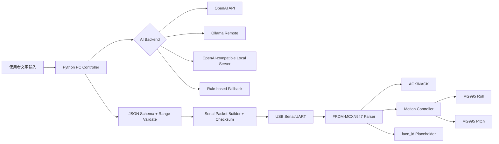

# Emotion Robot Controller

電腦端 AI 情緒判斷 -> Serial/UART 指令 -> FRDM-MCXN947 -> 兩顆 MG995 伺服馬達控制頭部 roll / pitch。

這個專案的目標不是概念 demo，而是一個可以逐步接線、燒錄、測試、debug、未來擴充到 Jetson Nano 或臉部螢幕的工程骨架。

## 1. 專案需求理解

你要做的是桌面機器人的頭部情緒控制系統：

1. 電腦接收文字輸入，未來可換成語音輸入。
2. 電腦呼叫 AI backend 判斷使用者情緒。
3. AI 只輸出結構化 JSON，不允許輸出 raw servo angle sequence。
4. Python 驗證 JSON 後轉成 Serial/UART 文字封包。
5. FRDM-MCXN947 收封包、驗 checksum、回 ACK/NACK。
6. FRDM 根據固定 motion library 控制 roll / pitch 兩顆 MG995。
7. face_id 目前先記錄與 log，未來接臉部表情螢幕。

## 2. 硬體假設

- 電腦透過 USB Serial / Virtual COM 連 FRDM-MCXN947。
- FRDM-MCXN947 輸出兩路 PWM signal：
  - roll servo：頭部左右歪頭。
  - pitch servo：頭部上下抬頭/低頭。
- MG995 使用一般 RC servo PWM：
  - 50 Hz。
  - 20 ms period。
  - 預設 pulse 500 us 到 2500 us，可在 `safety.c` 調整。
- 伺服中心角是 90 度。
- 預設安全角度：
  - roll: 55 / 90 / 125。
  - pitch: 55 / 90 / 125。

重要：MG995 不可直接用 FRDM 開發板 5V 腳供電。請使用外部 5V~6V 大電流電源，兩顆建議至少 3A，並且外部電源 GND 必須和 FRDM GND 共地。

## 3. 軟體假設

- Python 3.10 以上。
- PC 端使用 `pyserial` 做 Serial。
- OpenAI 雲端 backend 使用 OpenAI Python SDK。
- Ollama backend 使用原生 `/api/chat` 或 `/api/generate`。
- LM Studio / llama.cpp server 使用 OpenAI-compatible `/v1/chat/completions`。
- FRDM 端實際 UART/PWM 初始化要依你的 MCUXpresso SDK 專案調整；本專案已把平台相依部分包成 stub/TODO。

## 4. 整體架構



## 5. Serial/UART 協定

一行一個命令，以 newline 結尾：

```text
$PAYLOAD*CS\n
```

checksum 是 payload 的 UTF-8 bytes XOR，範圍是 `$` 後面、`*` 前面。

### ACT

```text
$ACT,seq,mode,face_id,motion_id,roll_bias,pitch_bias,speed,hold_ms*checksum
```

範例：

```text
$ACT,12,DIALOGUE,FACE_HAPPY,HAPPY_NOD_SWAY,0,-5,25,1200*CS
```

### EMO

```text
$EMO,seq,emotion*checksum
```

範例：

```text
$EMO,13,happy*CS
```

### TEST

```text
$TEST,seq,motion_id*checksum
```

常用：

```text
$TEST,14,CENTER*CS
$TEST,15,ROLL_LEFT*CS
$TEST,16,PITCH_DOWN*CS
```

### RESET / STATUS / HEARTBEAT

```text
$RESET,seq*checksum
$STATUS,seq*checksum
$PING,seq*checksum
```

FRDM 回覆：

```text
$ACK,seq,OK*checksum
$NACK,seq,ERROR_CODE,ERROR_MESSAGE*checksum
$PONG,seq,OK*checksum
$STATUS,seq,OK,face=FACE_NEUTRAL,busy=0*checksum
```

錯誤碼：

```text
BAD_CHECKSUM
UNKNOWN_CMD
BAD_FIELD_COUNT
UNKNOWN_EMOTION
UNKNOWN_MOTION
VALUE_OUT_OF_RANGE
BUSY
```

產生正確 checksum 可以用：

```bash
python -c "from pc_controller.serial.checksum import add_checksum; print(add_checksum('PING,1'))"
```

## 6. 情緒與 Motion 對應表

| emotion | 使用者情緒定義 | robot_emotion | face_id | motion_id | roll / pitch 特徵 | 速度/幅度/停頓 | 回中 | 回覆語氣 |
| --- | --- | --- | --- | --- | --- | --- | --- | --- |
| neutral | 普通描述，沒有明顯情緒 | neutral | FACE_NEUTRAL | CENTER | 回正 | 慢，中性停頓 | 是 | 平穩、自然 |
| happy | 開心、順利、被支持 | happy | FACE_HAPPY | HAPPY_NOD_SWAY | 小幅左右歪頭 + 輕點頭 | 中快，小幅，約 1200 ms | 是 | 明亮、親切 |
| excited | 很期待、能量高 | excited | FACE_EXCITED | EXCITED_FAST_NOD | 比 happy 快的點頭與小擺動 | 快，中幅，短停頓 | 是 | 有活力 |
| sad | 難過、失落、想哭 | sad | FACE_SAD | SAD_LOWER_HEAD | 小偏一側 + 慢慢低頭 | 慢，小幅，長停頓 | 否 | 溫柔安慰 |
| tired | 很累、沒力、撐不下去 | tired | FACE_TIRED | TIRED_DROOP | 幾乎不 roll，pitch 慢慢下垂 | 很慢，小幅，長停頓 | 否 | 低刺激、關心 |
| angry | 生氣、不公平、煩躁 | concerned | FACE_ANGRY | ANGRY_SHORT_SHAKE | 快速小幅 roll，pitch 略低 | 中快，小幅，短停頓 | 是 | 承接情緒 |
| surprised | 驚訝、意外、嚇到 | surprised | FACE_SURPRISED | SURPRISED_POP_UP | roll 置中，pitch 快速抬頭 | 快，中幅，短停頓 | 是 | 短促驚訝 |
| curious | 好奇、提問、探索 | curious | FACE_CURIOUS | CURIOUS_TILT | 單側歪頭 + 微抬頭 | 中等，中幅，有停頓 | 是 | 有興趣 |
| confused | 不懂、混亂、卡住 | confused | FACE_CONFUSED | CONFUSED_DOUBLE_TILT | 左右各歪一次，pitch 微低 | 中等，中幅，停頓 | 是 | 釐清、簡化 |
| thinking | 思考、權衡、決策 | thinking | FACE_THINKING | THINKING_LOOK_DOWN_UP | 小幅偏移，低頭再微抬 | 慢，小幅，沉思停頓 | 是 | 沉穩、提出選項 |
| concerned | 擔心、焦慮、壓力 | concerned | FACE_CONCERNED | CONCERNED_SOFT_NOD | 很小幅偏頭 + 柔和點頭 | 慢，小幅，長停頓 | 否 | 安定、接住 |
| sleepy | 想睡、睏、睡眠不足 | sleepy | FACE_SLEEPY | SLEEPY_BREATH | 幾乎不 roll，pitch 很慢起伏 | 很慢，極小幅 | 否 | 放慢、溫和 |

同一份對應存在於：

- PC 端：`emotion_map.yaml`、`pc_controller/emotion_map.py`。
- FRDM 端：`frdm_firmware/motion_profiles.c/.h`。

## 7. 專案資料夾結構

```text
emotion_robot_controller/
├─ README.md
├─ requirements.txt
├─ .env.example
├─ config.yaml
├─ emotion_map.yaml
├─ run_text_api.py
├─ run_text_local_remote.py
├─ run_manual_test.py
├─ run_serial_monitor.py
├─ pc_controller/
│  ├─ __init__.py
│  ├─ config_loader.py
│  ├─ models.py
│  ├─ emotion_schema.py
│  ├─ emotion_map.py
│  ├─ fallback_rules.py
│  ├─ backends/
│  │  ├─ __init__.py
│  │  ├─ base_backend.py
│  │  ├─ openai_backend.py
│  │  ├─ ollama_backend.py
│  │  ├─ openai_compatible_backend.py
│  │  └─ rule_based_backend.py
│  ├─ serial/
│  │  ├─ __init__.py
│  │  ├─ checksum.py
│  │  ├─ packet_builder.py
│  │  ├─ serial_bridge.py
│  │  └─ serial_monitor.py
│  └─ prompts/
│     ├─ emotion_system_prompt.txt
│     └─ local_model_prompt.txt
└─ frdm_firmware/
   ├─ README_FRDM.md
   ├─ main.c
   ├─ uart_protocol.c
   ├─ uart_protocol.h
   ├─ command_parser.c
   ├─ command_parser.h
   ├─ motion_controller.c
   ├─ motion_controller.h
   ├─ motion_profiles.c
   ├─ motion_profiles.h
   ├─ servo_driver.h
   ├─ servo_driver_stub.c
   ├─ face_controller.c
   ├─ face_controller.h
   ├─ safety.c
   └─ safety.h
```

## 8. Python 環境安裝

先進入專案：

```bash
cd emotion_robot_controller
```

Windows PowerShell:

```powershell
python -m venv .venv
.venv\Scripts\activate
pip install -r requirements.txt
```

Linux/macOS:

```bash
python3 -m venv .venv
source .venv/bin/activate
pip install -r requirements.txt
```

## 9. `.env` 設定

複製範例：

Windows PowerShell:

```powershell
Copy-Item .env.example .env
```

Linux/macOS:

```bash
cp .env.example .env
```

或直接在 terminal 設環境變數。

OpenAI API key：

Windows PowerShell:

```powershell
$env:OPENAI_API_KEY="<your-openai-api-key>"
```

Linux/macOS:

```bash
export OPENAI_API_KEY="<your-openai-api-key>"
```

OpenAI-compatible local server key，很多本地 server 任意字串即可：

Windows PowerShell:

```powershell
$env:LOCAL_API_KEY="<local-api-key>"
```

Linux/macOS:

```bash
export LOCAL_API_KEY="<local-api-key>"
```

## 10. `config.yaml` 設定

先改 Serial port：

Windows 常見：

```yaml
serial:
  port: COM5
```

Linux 常見：

```yaml
serial:
  port: /dev/ttyACM0
```

macOS 常見：

```yaml
serial:
  port: /dev/tty.usbmodemXXXX
```

如果你的 FRDM 目前透過 `SMONITORCOMMAND` 指令表收命令，請設定：

```yaml
serial:
  command_prefix: ERobot
```

這樣 Python 實際送到 UART 的內容會是：

```text
ERobot $ACT,1,API,FACE_TIRED,TIRED_DROOP,0,8,12,1800*CS
```

如果 FRDM 已經能直接讀 raw UART line，例如 `$ACT,...*CS`，就保持：

```yaml
serial:
  command_prefix: ""
```

切換 AI backend：

```yaml
ai:
  backend: openai
```

可選：

```yaml
ai:
  backend: ollama
```

```yaml
ai:
  backend: openai_compatible
```

```yaml
ai:
  backend: rule_based
```

## 11. AI 輸出 JSON Schema

AI 必須回傳這種 JSON：

```json
{
  "user_emotion": "happy",
  "robot_emotion": "happy",
  "face_id": "FACE_HAPPY",
  "motion_id": "HAPPY_NOD_SWAY",
  "roll_bias": 0,
  "pitch_bias": -5,
  "speed": 25,
  "hold_ms": 1200,
  "reply_text": "聽起來很棒！我也替你開心。",
  "confidence": 0.88
}
```

限制：

- `user_emotion` / `robot_emotion` 必須是 12 種允許情緒。
- `face_id` 必須在允許表情 ID 清單。
- `motion_id` 必須在允許動作 ID 清單。
- `roll_bias` / `pitch_bias`：-20 到 20。
- `speed`：1 到 100。
- `hold_ms`：0 到 5000。
- `confidence`：0 到 1。

OpenAI backend 會使用嚴格 JSON schema response format。Local backend 仍會做本地 validate；如果模型輸出非法 JSON，會 retry 一次，再失敗就走 `rule_based_backend`。

## 12. 執行 OpenAI API 版

確認 `config.yaml`：

```yaml
ai:
  backend: openai
  openai:
    model: gpt-4o-mini
    api_key_env: OPENAI_API_KEY
```

執行：

```bash
python run_text_api.py
```

測試輸入：

```text
我今天真的很累，有點撐不下去了
```

預期：

1. 程式印出 AI JSON。
2. 送出 `$ACT,...`。
3. FRDM 回 `$ACK,...`。
4. terminal 印出 `reply_text`。

如果你還沒接 FRDM，可以先跑：

```bash
python run_text_api.py --no-serial
```

## 13. 執行 Ollama 遠端版

家裡桌機先跑 Ollama，確認模型存在：

```bash
ollama pull llama3.1:8b
ollama serve
```

外部電腦測試連線：

```bash
curl http://YOUR_HOME_PC_IP:11434/api/generate -d "{\"model\":\"MODEL_NAME\",\"prompt\":\"hello\",\"stream\":false}"
```

`config.yaml`：

```yaml
ai:
  backend: ollama
  ollama:
    base_url: http://YOUR_HOME_PC_IP:11434
    model: llama3.1:8b
    stream: false
    api: chat
```

執行：

```bash
python run_text_local_remote.py --backend ollama
```

不接 FRDM 先測：

```bash
python run_text_local_remote.py --backend ollama --no-serial
```

## 14. 執行 OpenAI-compatible 本地模型版

適用 LM Studio、llama.cpp server、vLLM 或其他相容 `/v1/chat/completions` 的 server。

測試：

```bash
curl http://YOUR_HOME_PC_IP:1234/v1/chat/completions \
  -H "Content-Type: application/json" \
  -H "Authorization: Bearer <local-api-key>" \
  -d "{\"model\":\"MODEL_NAME\",\"messages\":[{\"role\":\"user\",\"content\":\"Return JSON {\\\"ok\\\":true}\"}],\"temperature\":0.2}"
```

`config.yaml`：

```yaml
ai:
  backend: openai_compatible
  openai_compatible:
    base_url: http://YOUR_HOME_PC_IP:1234/v1
    api_key_env: LOCAL_API_KEY
    model: local-model
```

執行：

```bash
python run_text_local_remote.py --backend openai_compatible
```

完全離線規則式文字判斷：

```bash
python run_text_local_remote.py --backend rule_based
```

## 15. 手動 Serial 測試

這個模式不呼叫 AI，最適合第一階段測 FRDM 與馬達：

```bash
python run_manual_test.py
```

可輸入：

```text
happy
sad
angry
curious
reset
status
ping
CENTER
ROLL_LEFT
ROLL_RIGHT
PITCH_UP
PITCH_DOWN
quit
```

只印封包、不開 Serial：

```bash
python run_manual_test.py --no-serial
```

指定 port：

```bash
python run_manual_test.py --port COM5
python run_manual_test.py --port /dev/ttyACM0
```

## 16. Serial Monitor

單純監聽與手動送 raw packet：

```bash
python run_serial_monitor.py
```

如果你要產生 packet 再貼到 monitor：

```bash
python -c "from pc_controller.serial.checksum import add_checksum; print(add_checksum('EMO,13,happy'))"
```

## 17. FRDM 韌體加入 MCUXpresso

詳細請看：

```text
frdm_firmware/README_FRDM.md
```

最短流程：

1. 建立 FRDM-MCXN947 MCUXpresso C project。
2. 把 `frdm_firmware/*.c`、`frdm_firmware/*.h` 加進 Source。
3. 先保留 `servo_driver_stub.c`，只看 parser 和 log。
4. 修改 `main.c` 的 UART read/write 與 delay TODO。
5. 用 Tera Term/PuTTY 測 `$PING,...`。
6. 再新增真正 `servo_driver_mcxn947.c`，從 build 排除 stub。
7. 依 SDK PWM 範例設定 PWM pin、period 20 ms、pulse 500~2500 us。

如果你要沿用目前已寫好的 `SLEEPGui/NORMALGui/MotorControlPitch/MotorControlYaw` 和 `SMONITORCOMMAND`，請看 `frdm_firmware/README_FRDM.md` 的「接到你目前的 SMONITORCOMMAND」。那裡已經提供：

- `ERobot` 指令表 entry。
- `EmotionRobotInit()` 初始化方式。
- `adapters/servo_driver_existing_monitor.c`：呼叫你的 `MotorControlPitch/MotorControlYaw`。
- `adapters/face_controller_existing_gui.c`：呼叫你的 `SLEEPGui/NORMALGui`。

請不要把 README 中的 PWM TODO 當成已知 MCXN947 API；實際 driver 名稱要看你安裝的 MCUXpresso SDK examples。

## 18. MG995 接線

MG995 常見三條線：

```text
Brown/Black  -> GND
Red          -> 外部 5V~6V
Orange/Yellow/White -> FRDM PWM signal
```

接線：

```text
外部電源 +5V/+6V  -> MG995 red
外部電源 GND      -> MG995 GND
FRDM GND          -> 外部電源 GND
FRDM PWM roll pin -> roll MG995 signal
FRDM PWM pitch pin-> pitch MG995 signal
```

再次提醒：

- 不要用 FRDM 5V 腳直接供兩顆 MG995。
- 共地是必要的。
- 如果伺服抖動，第一優先檢查供電與共地。

## 19. 測試流程

### A. 只測 Python 封包

```bash
python run_manual_test.py --no-serial
```

輸入：

```text
ping
happy
reset
```

確認會印出 `$PING,...`、`$EMO,...`、`$RESET,...`。

### B. 不接馬達，測 FRDM parser

1. FRDM 燒錄使用 `servo_driver_stub.c` 的韌體。
2. 開 Serial terminal。
3. 執行：

```bash
python run_manual_test.py
```

4. 輸入 `ping`，確認 `$PONG,...`。
5. 輸入 `happy`，確認 `$ACK,...` 與 stub log。

### C. 單顆 roll 馬達

1. 只接 roll MG995。
2. 外部供電與共地。
3. 執行：

```bash
python run_manual_test.py
```

4. 依序測：

```text
CENTER
ROLL_LEFT
ROLL_RIGHT
reset
```

### D. 單顆 pitch 馬達

測：

```text
CENTER
PITCH_UP
PITCH_DOWN
reset
```

如果上下相反，先用 `g_safety_config.pitch.invert = true`，不要急著改 motion profile。

### E. 兩顆馬達

測：

```text
reset
happy
sad
angry
curious
sleepy
```

若任何動作太大，先縮小 `frdm_firmware/safety.h` 的安全角度。

### F. AI 到 FRDM 端到端

OpenAI：

```bash
python run_text_api.py
```

本地遠端模型：

```bash
python run_text_local_remote.py --backend ollama
python run_text_local_remote.py --backend openai_compatible
```

測試句：

```text
我今天真的很累，有點撐不下去了
```

預期 motion 多半是 `TIRED_DROOP` 或 `CONCERNED_SOFT_NOD`。

## 20. 常見錯誤排查

### 1. 找不到 Serial port

- Windows 到裝置管理員看 COM 編號。
- Linux/macOS 執行：

```bash
ls /dev/ttyACM* /dev/ttyUSB* 2>/dev/null
ls /dev/tty.usb* /dev/tty.modem* 2>/dev/null
```

- 修改 `config.yaml serial.port` 或用 `--port`。

### 2. Permission denied

Linux 把使用者加入 dialout：

```bash
sudo usermod -a -G dialout $USER
```

登出再登入，或重開機。

### 3. FRDM 沒有回 ACK

- 確認 baudrate 115200。
- 確認 line ending 是 LF。
- 確認 FRDM 的 UART read_line 已實作。
- 先送 `ping`。
- 用 Tera Term/PuTTY 看板端 log。

### 4. checksum 錯誤

- 不要手算，使用 Python 產生：

```bash
python -c "from pc_controller.serial.checksum import add_checksum; print(add_checksum('PING,1'))"
```

- 確認 payload 中沒有多餘空白。

### 5. 馬達不動

- 確認已替換 `servo_driver_stub.c`。
- 確認 PWM pin mux。
- 確認 PWM frequency 50 Hz。
- 確認 signal/GND 接線。

### 6. 馬達抖動

- 優先檢查外部電源電流。
- 確認 FRDM GND 與外部電源 GND 共地。
- 使用較粗電源線。
- 伺服端加電容可改善瞬間壓降。

### 7. 板子重開機

- 幾乎都是伺服拉電流造成壓降或回灌。
- 不要由 FRDM 供電給 MG995。
- USB 只供 FRDM，伺服用外部供電。

### 8. MG995 供電不足

- 兩顆 MG995 在負載下瞬間電流可能很高。
- 換 5V~6V 大電流電源。
- 先不帶機構空載測，再逐步上機構。

### 9. 馬達方向相反

在 FRDM 初始化時設定：

```c
g_safety_config.roll.invert = true;
g_safety_config.pitch.invert = true;
```

### 10. pitch/roll 定義反了

- 先交換 PWM pin 或通道 mapping。
- 再檢查 `ServoChannel` 對應。
- motion profile 使用 logical roll/pitch，不建議直接亂改每個 sequence。

### 11. AI 回傳不是 JSON

- 程式會 retry 一次。
- 再失敗會 fallback 到 rule-based。
- 看 `logs/controller.log`。
- 本地模型太小時，建議改用較強模型或降低 temperature。

### 12. OpenAI API key 錯誤

- 確認 `OPENAI_API_KEY`。
- 確認 `.env` 在專案根目錄。
- 用 `--no-serial` 先測 AI：

```bash
python run_text_api.py --no-serial
```

### 13. Ollama 連不到

- 在家裡桌機確認：

```bash
curl http://127.0.0.1:11434/api/tags
```

- 從外部電腦確認：

```bash
curl http://YOUR_HOME_PC_IP:11434/api/tags
```

### 14. 家裡桌機防火牆擋住

- Windows Defender Firewall 放行 Ollama/LM Studio port。
- 確認服務有 bind 到 LAN IP，不只是 `127.0.0.1`。

### 15. VPN / Tailscale 連線問題

- 先 ping Tailscale IP。
- 用 `curl http://TAILSCALE_IP:11434/api/tags` 測。
- 確認 Tailscale ACL 沒擋。

### 16. 模型回應太慢

- 降低模型大小。
- 使用 Ollama `stream:false` 仍會等完整 JSON，這是正常的。
- 比賽 demo 可切 `ai.backend: rule_based`。

### 17. 情緒永遠判成 neutral

- 檢查 prompt 是否被本地模型忽略。
- 看 `logs/controller.log` 是否 fallback。
- 本地模型可改大一點，或先使用 OpenAI backend。

### 18. 動作太大或打到機構

- 先縮安全角度：

```c
#define ROLL_MIN_DEG 70
#define ROLL_MAX_DEG 110
#define PITCH_MIN_DEG 70
#define PITCH_MAX_DEG 110
```

- 確認所有動作都經過 clamp，不要讓 AI 控 raw angle。

### 19. 動作太僵硬

- 降低 speed。
- 增加 motion step 的 `duration_ms`。
- 加一點 `hold_ms`。
- 保持 20 ms update，不要一次跳到目標角。

### 20. 比賽現場網路不穩怎麼 fallback

- 手動模式永遠可用：

```bash
python run_manual_test.py
```

- 或切成規則式：

```yaml
ai:
  backend: rule_based
```

你也可以讓 `run_text_api.py` 在 API 失敗時自動 fallback，這已經實作。

## 21. 未來換成 Jetson Nano

FRDM 端協定不需要改。Jetson 只要能送同樣的文字封包即可：

```text
$ACT,seq,mode,face_id,motion_id,roll_bias,pitch_bias,speed,hold_ms*checksum
```

可沿用：

- `pc_controller/serial/checksum.py`
- `pc_controller/serial/packet_builder.py`
- `pc_controller/serial/serial_bridge.py`

Jetson 上的語音/STT 模組只需要最後產生 `EmotionDecision` 或直接送 `EMO`/`ACT`。

## 22. 未來加入臉部表情螢幕

目前 FRDM 會收 `face_id` 並呼叫：

```c
face_set_face_id(cmd->face_id);
```

你之後可以把 `face_controller.c` 改成：

- SPI/I2C/UART 傳給表情螢幕。
- 根據 `FACE_HAPPY` 顯示圖片或動畫。
- 與 motion 同步，例如先換臉再動頭。

不需要改 PC 端協定。

## 23. 未來加入語音輸入

語音輸入只要接在 `run_text_api.py` 前面：

```text
microphone -> STT -> text -> backend.analyze(text) -> Serial ACT
```

可以新增：

```text
run_voice_api.py
run_voice_local_remote.py
```

重用現有 backend 與 serial bridge。

## 24. Demo 建議流程

1. 不接馬達，跑 `python run_manual_test.py --no-serial`。
2. 燒錄 FRDM stub 韌體，只測 `ping` / `happy` ACK。
3. 接 roll 單顆，測 `CENTER` / `ROLL_LEFT` / `ROLL_RIGHT`。
4. 接 pitch 單顆，測 `PITCH_UP` / `PITCH_DOWN`。
5. 接兩顆，測 `reset`。
6. 測 `happy` / `sad` / `angry` / `curious`。
7. 跑 `python run_text_api.py --no-serial` 看 AI JSON。
8. 最後跑完整端到端 `python run_text_api.py`。
